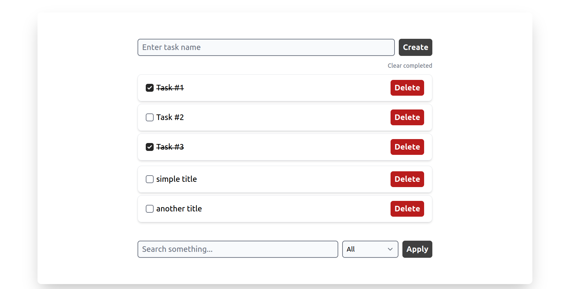
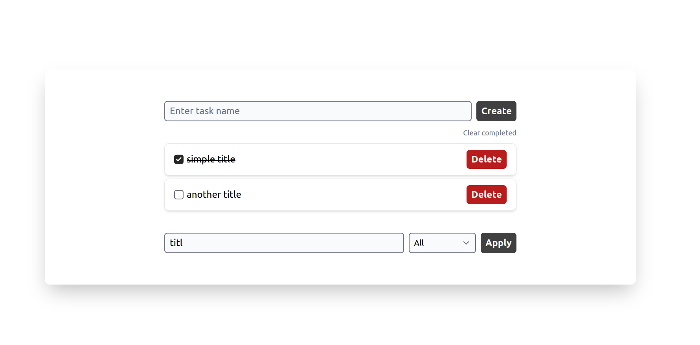
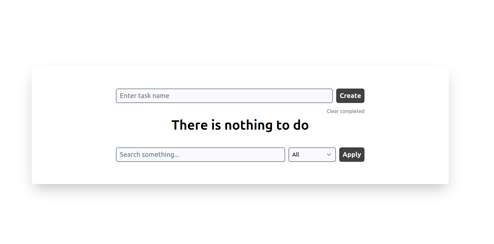

# Todo-app

Простое ToDo-list подобное приложение.

Цель приложения:
- Отработать навыки работы с blade компонентами.
- Отработать навыки работы с tailwindcss.
- Отработать навыки работы с моделями и базой данных.
- Научиться отправлять ajax запросы на нативном javascript.

Список используемых технологий:
- laravel 11
- mysql
- tailwindcss
- javascript

### Установка

1. Клонируйте репозиторий:
   ```bash
   git clone https://github.com/xynzsqd/todo-app.git
   ```
2. Создайте .env файл по шаблону .env.example
- настройте подключение к свой базе данных
    ```
    DB_CONNECTION=mysql
    DB_HOST=127.0.0.1
    DB_PORT=3306
    DB_DATABASE=laravel
    DB_USERNAME=root
    DB_PASSWORD=
    ```

2. Убедитесь что у вас установлен docker.

3. в директории проекта выполните команду:
    ```bash
    ./vendor/bin/sail up -d
4. чтобы остановить контейнеры выполните команду:
    ```bash
    ./vendor/bin/sail up -d
    ```
    эта команда остановит приложение.

### Главная страница

-
### Главная страница поиск

-

### Главная страница без задач

